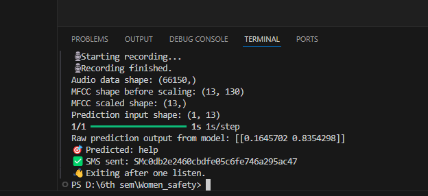

🛡️ Women Safety Voice Alert System
A real-time AI-based voice command safety system designed to help women in emergency situations. This application listens for specific voice cues (like "help", "save me", etc.) and triggers an alert such as sending an SMS with the user's location.

🚀 Features
🎙️ Voice Command Detection using ML & MFCC features

📡 SMS Alert triggered to a predefined number

🔊 Voice Feedback: Confirms the alert with speech like “Alert sent, help is on the way”

📳 False Alarm Prevention: Plays a beep sound so the user can cancel if accidental

📍 (Optional) Location data integration

🛠️ Tech Stack
Python
TensorFlow / Keras
Librosa
SoundDevice
Twilio (for sending SMS)
pyttsx3 (for voice response)
NumPy / Pandas

📂 Project Structure
Women_safety/
├── model/ → Trained ML model (.h5)
├── final_test.py → Main voice detection and alert script
├── training_script.py → (optional) Model training script
├── requirements.txt → Required Python packages
├── README.md → This file

🧪 How to Run
Install Python 3.9 or later

Install dependencies:
pip install -r requirements.txt

Run the main script:
python final_test.py

Make sure you have your trained model file placed inside the model/ folder and your Twilio credentials properly set in the script.

🔮 Future Enhancements
📱 Convert to Android app using Kivy or BeeWare

📍 Live GPS location integration with Google Maps API

⏳ Background passive listening

🛑 Emergency cancellation option within a few seconds

## 📸 Screenshots

### Terminal Output

### SMS Sent Confirmation

👩‍💻 Author
Kiran C
B tech Student , REVA University
GitHub: https://github.com/Kiran-720

